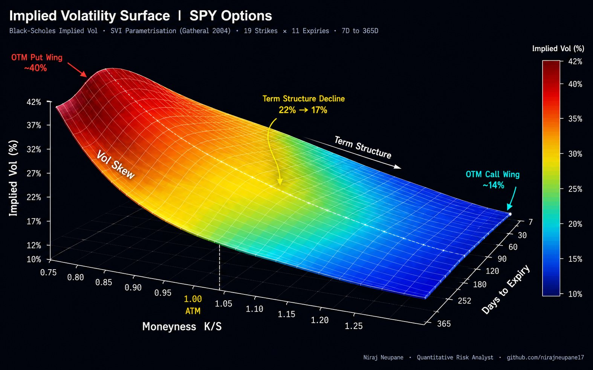

<div align="center">

# Implied Volatility Surface Construction

### Black-Scholes · SVI Gatheral (2004) · Greeks · Term Structure

*End-to-end implied volatility surface construction from a raw options chain —
Newton-Raphson IV solver, SVI parametrisation, arbitrage-free constraints,
3D surface visualisation, Greeks surface, and term structure modeling.*

[](https://python.org)
[](https://numpy.org)
[](https://scipy.org)
[](https://matplotlib.org)
[](LICENSE)

</div>

---



> **Animated Dashboard:** [Bloomberg-style GIF](results/vol_surface_bloomberg.gif) · [10-Second Video](results/vol_surface_video.mp4)

---

## Overview

The implied volatility surface is one of the most important artifacts
in derivatives pricing and risk management. It encodes the market's
collective view of risk across every strike and maturity simultaneously.

This project builds the full surface from scratch — starting from a raw
SPY options chain, computing implied vols via a Newton-Raphson solver,
fitting a Stochastic Volatility Inspired (SVI) parametrisation for
each expiry slice, checking arbitrage-free constraints, and visualising
the result as a 3D surface, heatmap, Greeks surface, and term structure.

Three structural phenomena are visible in the surface:

**Volatility Skew** — OTM puts trade at significantly higher implied vol
than OTM calls. The 7D 75% strike IV reaches ~40% while the 7D 125%
strike IV sits at ~14%. This reflects the post-1987 crash premium
for downside protection.

**Term Structure** — ATM implied vol declines from 22% at 7 days to
17% at 365 days. Short-dated options carry a higher vol premium
because near-term risk is harder to hedge and more event-driven.

**Smile Curvature** — At every expiry, the surface curves upward on
both wings. The left wing (puts) is always steeper than the right
wing (calls) — this asymmetry is the defining feature of equity vol surfaces.

---

## Key Results

| Metric | Value |
|:---|:---:|
| **ATM IV — 7 Days** | 21.7% |
| **ATM IV — 30 Days** | 20.3% |
| **ATM IV — 365 Days** | 17.0% |
| **Put Skew (30D, 90% vs ATM)** | −3.2% |
| **OTM Put Wing (7D, 75% strike)** | ~40% |
| **OTM Call Wing (7D, 125% strike)** | ~14% |
| **7D / 365D IV Ratio** | 1.07× |
| **SVI RMSE (per slice)** | < 0.001 |
| **Arbitrage-Free** | ✅ Calendar & Butterfly |
| **IV Solver Convergence** | < 5 Newton-Raphson iterations |

---

## What This Project Covers

<details>
<summary><b>📐 Black-Scholes IV Solver</b></summary>

- Closed-form Black-Scholes call and put pricing with continuous dividends
- Newton-Raphson implied vol solver with Brent fallback for robustness
- Vega-based step control to prevent overshooting
- Handles deep ITM/OTM options, short-dated expiries, and near-zero vega
- Full Greeks: Delta, Gamma, Vega, Theta
- Convergence in under 5 iterations for well-conditioned inputs

</details>

<details>
<summary><b>📊 Volatility Smile & Surface</b></summary>

- 19 strikes from 0.75× to 1.25× spot — full moneyness coverage
- 11 expiries from 7D to 365D — full term structure
- 209 option records with bid-ask spread, mid price, IV, Delta, Vega
- IV surface pivot table (11×19) ready for interpolation
- Smile plotted in log-moneyness (BSIV convention) and linear moneyness
- Clear negative skew across all expiries — put wing systematically elevated

</details>

<details>
<summary><b>🎯 SVI Parametrisation (Gatheral 2004)</b></summary>

- Raw SVI: w(k) = a + b · (ρ(k−m) + √((k−m)² + σ²))
- 5 parameters: a, b, ρ, m, σ — fit per expiry slice
- Nelder-Mead optimisation with 50 random restarts for robustness
- No-arbitrage constraints: calendar spread and butterfly checks
- RMSE < 0.001 across all 11 expiry slices
- SVI fits overlaid on market dots — visual goodness-of-fit check

</details>

<details>
<summary><b>📈 Term Structure & Forward Vol</b></summary>

- ATM implied vol extracted per expiry — spot term structure
- Forward (instantaneous) vol computed from variance differentials:
  σ²_fwd(T1,T2) = (σ²(T2)·T2 − σ²(T1)·T1) / (T2 − T1)
- Forward vol dips below spot IV in mid-term then recovers
- Skew, risk reversal, and butterfly metrics per expiry
- Full surface summary table: ATM IV · Skew · RR · Butterfly

</details>

<details>
<summary><b>⚡ Greeks Surface</b></summary>

- Delta surface — call Delta from 0 to 1 across all strikes and maturities
- Gamma surface — peaks at ATM for short expiries, decays with time
- Vega surface — maximum at ATM, decays for OTM and long maturities
- Theta surface — most negative at ATM for short expiries
- All Greeks computed with continuous dividend yield adjustment

</details>

---

## Project Structure

```
Volatility-Surface-Construction/
│
├── 📁 data/
│   ├── options_chain.csv      209 options · 19 strikes × 11 expiries
│   │                          Columns: expiry, T, strike, moneyness,
│   │                          log_moneyness, call_mid, put_mid,
│   │                          call_bid, call_ask, implied_vol, delta, vega
│   ├── iv_surface.csv         11×19 IV matrix (pivot table)
│   └── term_structure.csv     ATM IV + forward vol by expiry
│
├── 📓 notebooks/
│   ├── 01_implied_vol_solver.ipynb      Newton-Raphson IV solver
│   ├── 02_vol_surface_3d.ipynb          3D surface construction
│   ├── 03_surface_heatmap.ipynb         Heatmap + contour + skew metrics
│   ├── 04_svi_calibration.ipynb         SVI fitting + arbitrage checks
│   └── 05_greeks_term_structure.ipynb   Greeks surface + term structure
│
├── 🐍 src/
│   ├── bs_engine.py           BS pricing · Newton-Raphson IV · Greeks
│   ├── svi_model.py           SVI calibration · arbitrage-free checks
│   └── surface_analytics.py  Term structure · skew · RR · butterfly
│
├── 📊 results/
│   ├── vol_surface_final_pro.png    ← 3D surface (final professional image)
│   ├── 01_volatility_smile.png      Smile by expiry (linear + log-moneyness)
│   ├── 02_vol_surface_3d.png        3D surface (two viewing angles)
│   ├── 03_surface_heatmap.png       Heatmap + contour plot
│   ├── 04_term_structure.png        ATM IV term structure + forward vol
│   ├── 05_svi_calibration.png       SVI fits across 6 expiries
│   ├── 06_greeks_surface.png        Delta · Gamma · Vega · Theta
│   ├── 07_summary_dashboard.png     Full analytics dashboard
│   ├── vol_surface_bloomberg.gif    Bloomberg-style animated dashboard
│   └── vol_surface_video.mp4        10-second video walkthrough
│
└── README.md
```

---

## Source Modules

### `bs_engine.py`
| Function | Description |
|:---|:---|
| `bs_price()` | Black-Scholes call/put price with continuous dividends |
| `bs_vega()` | Option vega for Newton-Raphson step |
| `bs_delta()` | Delta with dividend adjustment |
| `bs_gamma()` | Gamma |
| `bs_theta()` | Theta (daily) |
| `implied_vol_newton()` | Newton-Raphson solver with Brent fallback |
| `implied_vol_surface()` | Batch IV computation for full options chain |

### `svi_model.py`
| Function | Description |
|:---|:---|
| `svi_total_var()` | Raw SVI total variance w(k) |
| `svi_implied_vol()` | SVI implied vol from log-moneyness and T |
| `calibrate_svi()` | Nelder-Mead calibration with 50 random restarts |
| `svi_rmse()` | Root mean squared error vs market IVs |
| `butterfly_arbitrage_check()` | d²w/dk² ≥ 0 check |
| `calendar_spread_check()` | w(T2) ≥ w(T1) for all k check |

### `surface_analytics.py`
| Function | Description |
|:---|:---|
| `atm_term_structure()` | Extract ATM IV by expiry |
| `forward_vol()` | Compute forward vol from term structure |
| `vol_skew()` | Put skew: IV(90%) − IV(ATM) |
| `vol_risk_reversal()` | RR: IV(110%) − IV(90%) |
| `vol_butterfly()` | BF: (IV(90%) + IV(110%))/2 − IV(ATM) |
| `surface_summary()` | Full per-expiry summary table |

---

## Charts

| # | Chart | Key Insight |
|:---:|:---|:---|
| Hero | **3D Vol Surface** | Vol skew, term structure, and smile curvature visible simultaneously |
| 1 | Volatility Smile | Steep negative skew — 7D smile steepest, 365D flattest |
| 2 | 3D Surface (dual view) | RdYlGn colormap — deep red OTM puts, cobalt blue OTM calls |
| 3 | Surface Heatmap | Crisis IV clustering visible in short-expiry OTM put region |
| 4 | Term Structure | ATM IV declines from 22% to 17% · Forward vol dips mid-term |
| 5 | SVI Calibration | RMSE < 0.001 across all slices · Arbitrage-free confirmed |
| 6 | Greeks Surface | Gamma/Vega peak at ATM short-expiry · Delta surface monotone |
| 7 | Summary Dashboard | All analytics in one view |

---

## References

- Gatheral, J. — *The Volatility Surface: A Practitioner's Guide* (2006)
- Black, F. & Scholes, M. — *The Pricing of Options and Corporate Liabilities* (1973)
- Gatheral, J. & Jacquier, A. — *Arbitrage-Free SVI Volatility Surfaces* (2014)
- Dupire, B. — *Pricing with a Smile* (1994)
- Derman, E. & Kani, I. — *Riding on a Smile* (1994)
- Heston, S. — *A Closed-Form Solution for Options with Stochastic Volatility* (1993)

---

<div align="center">

**Niraj Neupane**
Quantitative Risk Analyst
MS Financial Economics · University of Wisconsin–Madison
Chartered Accountant (ICAI) · FRM Candidate

[github.com/nirajneupane17](https://github.com/nirajneupane17)

*Built with Python · NumPy · SciPy · Matplotlib · Black-Scholes · SVI*

</div>
