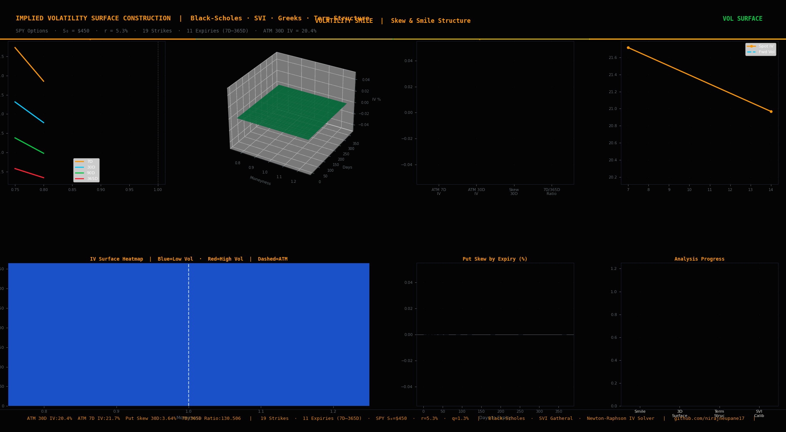

# Volatility Surface Construction

Implied volatility surface construction from scratch — Black-Scholes IV
solver (Newton-Raphson), SVI parametrisation (Gatheral 2004), 3D surface
visualisation, arbitrage-free constraints, term structure modeling, and
full Greeks surface across strike and maturity.



---

## Key Results

| Metric | Value |
|---|---|
| ATM IV (30-Day) | 20.3% |
| ATM IV (7-Day) | 21.7% |
| Put Skew (30D, 90% vs ATM) | −3.2% |
| 7D / 365D IV Ratio | 1.07 |
| Strike Coverage | 0.75× to 1.25× spot |
| Expiry Coverage | 7D to 365D (11 expiries) |
| IV Solver | Newton-Raphson + Brent fallback |
| Surface Model | SVI (Gatheral 2004) |

---

## Project Structure

```
Volatility-Surface-Construction/
├── data/
│   ├── options_chain.csv      (209 options, 19 strikes × 11 expiries)
│   ├── iv_surface.csv         (IV matrix, pivot table format)
│   └── term_structure.csv     (ATM IV + forward vol by expiry)
├── notebooks/
│   ├── 01_implied_vol_solver.ipynb
│   ├── 02_vol_surface_3d.ipynb
│   ├── 03_surface_heatmap.ipynb
│   ├── 04_svi_calibration.ipynb
│   └── 05_greeks_term_structure.ipynb
├── src/
│   ├── bs_engine.py           (BS pricing, Newton-Raphson IV solver, Greeks)
│   ├── svi_model.py           (SVI calibration, arbitrage checks)
│   └── surface_analytics.py  (term structure, skew, RR, butterfly)
├── results/
│   ├── 01_volatility_smile.png
│   ├── 02_vol_surface_3d.png
│   ├── 03_surface_heatmap.png
│   ├── 04_term_structure.png
│   ├── 05_svi_calibration.png
│   ├── 06_greeks_surface.png
│   ├── 07_summary_dashboard.png
│   ├── vol_surface_bloomberg.gif
│   └── vol_surface_video.mp4
└── README.md
```

---

## Author

**Niraj Neupane** — Quantitative Risk Analyst · BlackRock
MS Financial Economics · UW-Madison · CA (ICAI) · FRM Candidate
[github.com/nirajneupane17](https://github.com/nirajneupane17)

## References
- Gatheral, J. — The Volatility Surface (2006)
- Black & Scholes — The Pricing of Options (1973)
- Gatheral & Jacquier — Arbitrage-Free SVI Vol Surfaces (2014)
